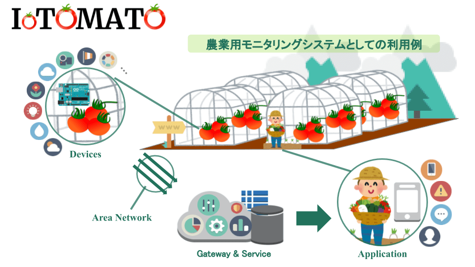
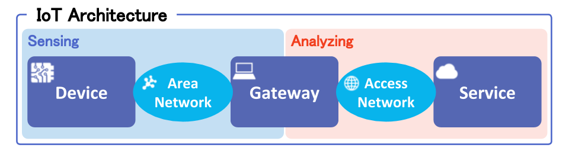
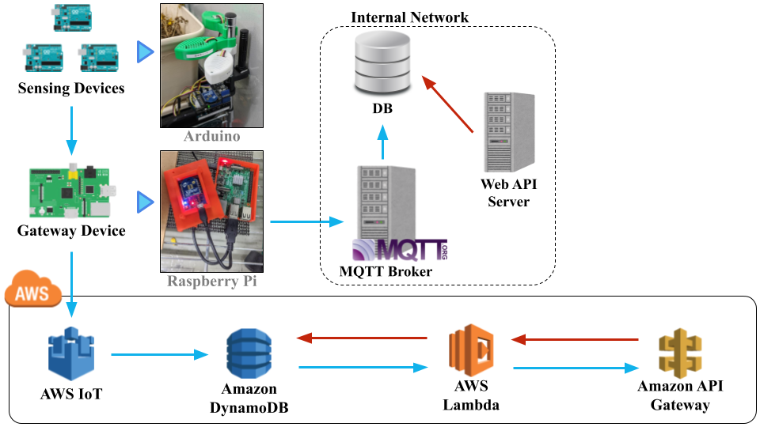

# 

## 概要
IoTOMATOはオープンなハードウェアとソフトウェアを使用した栽培用モニタリングシステム開発プロジェクトです。  
センシングデバイスを容易に追加することが可能なスケーラブルでシームレスなIoTシステムを目指しています。  
IoTOMATOを利用して植物や野菜の栽培を始めましょう。

## システム構成

### 特徴
- センサデータを蓄積し、可視化することができる
- センサデバイスの追加や取り外しが容易である
- システムの運用や管理を意識する必要がない

### IoTアーキテクチャ
本システムは下記に示されているIoTアーキテクチャに基づいて構成されています。  
IoTアーキテクチャは3つのコンポーネントから構成されています。

#### デバイス部
　デバイス部では、センサやアクチュエータを搭載したデバイスが現実世界の現象に対して収集を行ったり、ある対象物の制御などを行います。  
現実世界の現象に対して収集を行うデバイスをセンシングデバイス呼び、対象物の制御などを行うデバイスをアクチュエーティングデバイスと呼びます。  

#### ゲートウェイ部
　センシングデバイスやアクチュエーティングデバイスがインターネットにアクセスするためのネットワーク機能を有さない場合、インターネットとデバイス部との間にゲートウェイ部を介在させる場合があります。  
というのもIoTとはあらゆるモノがインターネットにつながることと考えられており、それらのモノ一つひとつがデバイスとして機能する場合、デバイス単体でサービス部にあるサーバに対してデータを送信すると回線接続や切断を制御する制御用回線に対して過負荷を与えることになります。  
また、IoTデバイスは通常のモバイルトラフィックに比べると送受信するデータ量が小さく、通信頻度が少ないにもかかわらず、それらのネットワークにアクセスするためには通信機能や消費電力において必要以上の能力を要してしまうためコストの観点から好ましいと考えられていません。  
このような背景から、ゲートウェイ部はデバイス部とサービス部との間に介在し、データの集約や中継を行う役割を持ちます。

　ゲートウェイ部はデバイス部の機能によって振る舞い(役割)が異なります。  
センシング機能の場合、センシングデバイスから送られたセンシングデータをいったん集約し、アクセスネットワークを通じてサービス部で稼働されているサーバへデータを送信する役割を担います。  
一方、アクチュエーティング機能の場合、アクセスネットワークを介してサービス部から受け取ったある種の操作データをエリアネットワークを通じてアクチュエーティングデバイスに送信する役割を担います。

#### サービス部
　サービス部はデバイス部からゲートウェイ部を経由して収集したデータをもとにユーザ対して何らかのサービス(価値提供)を行います。  
　サービス部は全体のシステムとしての機能(振る舞い)とユーザに対する機能(振る舞い)の二面性があると考えています。  
システムとしての機能とはセンサデータを蓄積したり、分析したりする機能のことです。また、デバイス部のアクチュエータに対して操作を行うための機能なども含まれます。  
一方でユーザに対する機能とはシステムがユーザに対して提供するの価値(サービス)のことです。  
ユーザはそのシステムを利用することで何ができるようになるのか・何を得ることができるのかということです。  
通常、ユーザはインターネットを介してサービスを使用します。したがってWebに関する技術が使われます。

### システムアーキテクチャ
下記に本プロジェクトのシステムアーキテクチャを示します。

