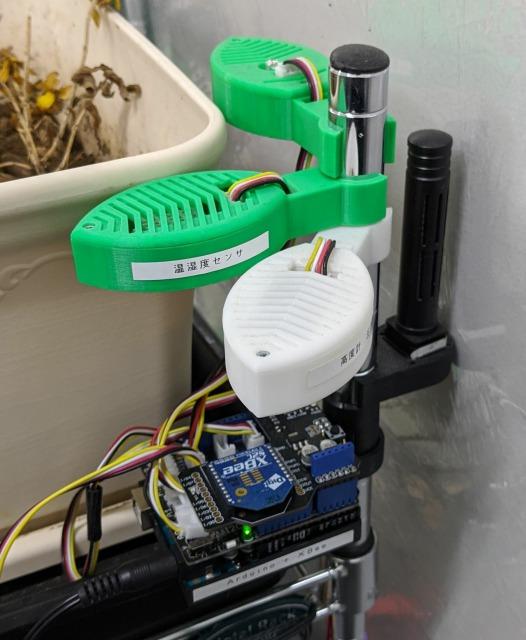

# デバイス部

## 環境用センシングデバイス

#### マイコンボード
- [Arduino Uno R3](https://www.switch-science.com/catalog/789/)  

- [Arduino用Groveシールド](http://wiki.seeedstudio.com/Base_Shield_V2/)  

#### センサー
- [温度・湿度センサー](http://wiki.seeedstudio.com/Grove-Temperature_and_Humidity_Sensor_Pro/)  

- [気圧センサー](http://wiki.seeedstudio.com/Grove-Barometer-High-Accuracy/)  
  

- [光センサー](http://wiki.seeedstudio.com/Grove-Light_Sensor/)  

- [CO2センサー](http://wiki.seeedstudio.com/Grove-CO2_Sensor/)  

- [超音波センサー](http://wiki.seeedstudio.com/Grove-Ultrasonic_Ranger/)  

#### エリアネットワーク用通信モジュール
- [XBeeモジュール](https://www.switch-science.com/catalog/4090/)  

- [Arduino用XBeeシールド](http://wiki.seeedstudio.com/XBee_Shield_V2.0/)  

